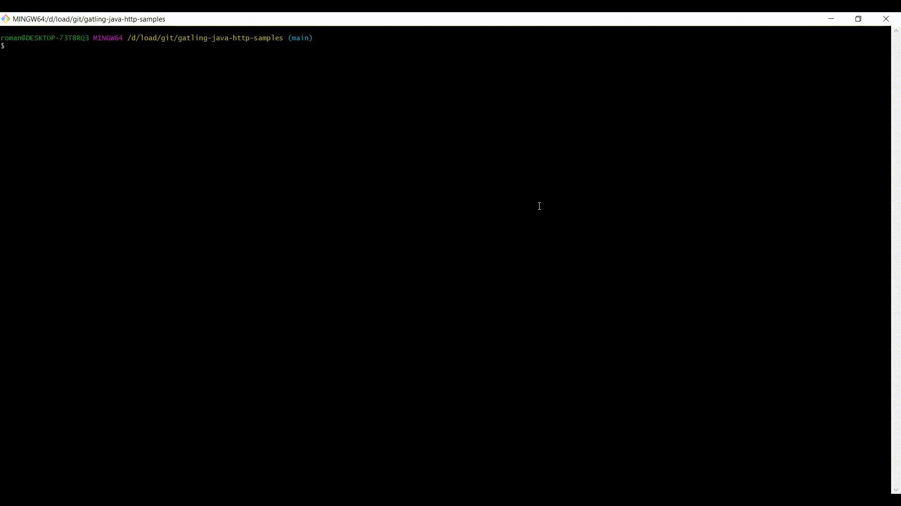

Gatling Java HTTP tests
=============================================

Примеры тестов.

Создано на основе проекта
[on the Gatling website](https://gatling.io/docs/current/extensions/gradle_plugin/) for usage.

# Web shopping

Для создания и демонстрации HTTP скриптов использовалось [это веб-приложение](https://github.com/Roman-Kislyy/web-tutorial-shopping-center)

# Небольшие инструкции по работе с Gatling и Gradle:
[docs/how-to-slides/Gtg-How to start test.pptx](Как запустить тест при помощи Gradle)
[docs/how-to-slides/Gtg-Variables.pptx](Какие бывают переменные в Gatling)
[docs/how-to-slides/Gtg-Scenario injections, load, users.pptx](Про разные сценарии нагрузки. Максимум, стресс и другое)
[docs/how-to-slides/Gtg-Termins, script structure.pptx](О структуре скриптов на Gatling. Термины для начинающих)
[docs/how-to-slides/Gtg-HTTP-Recording.pptx](Как воспользоваться HTTP recorder для записи скрипта)
 
# Быстрый старт

Как запустить тест при помощи Gradle plugin.

`./gradlew.bat gatlingRun-servicename.simulations.OpenInjecjionsSimulation`

или 

`gradlew.bat gatlingRun-servicename.simulations.OpenInjecjionsSimulation`

В зависимости от окружения.

